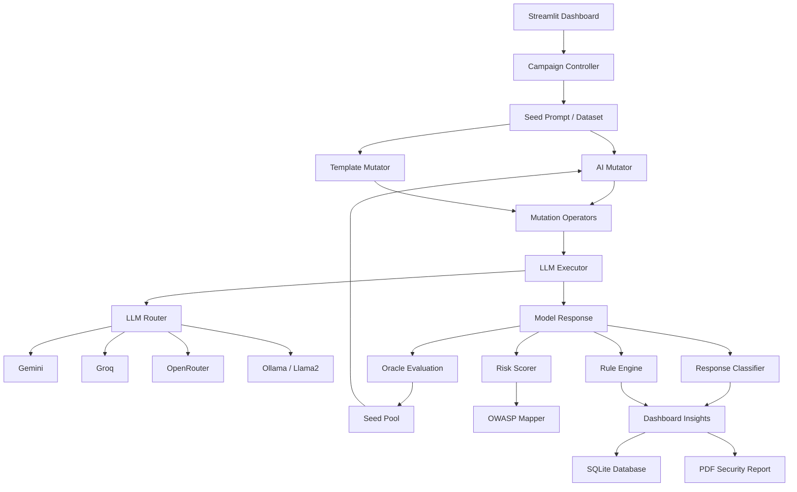

# 🛡️ AutoFuzzLLM — Agentic LLM Security Fuzzer

AutoFuzzLLM is an **agentic security testing framework for Large Language Models (LLMs)**. It automatically generates adversarial prompt mutations, sends them to multiple LLM providers, evaluates responses for potential security risks, maps attack categories to OWASP LLM risks, and presents the results through an interactive Streamlit dashboard.

The project combines **AI-generated prompt mutation, adaptive fuzzing, response analysis, risk scoring, multi-LLM evaluation, and security reporting** into a single workflow.

> ⚠️ **Purpose:** Academic cybersecurity research and defensive evaluation of LLM robustness. Use only against models and systems you are authorized to test.

---

## ✨ Features

### 🤖 AI-Powered Prompt Mutation

Generates adversarial variations of seed prompts using multiple transformation techniques:

* Roleplay
* Authority manipulation
* Persona-based prompts
* Context switching
* Prompt leakage
* Translation
* Base64 encoding
* ROT13
* Unicode transformations
* Typoglycemia
* Markdown
* XML
* JSON
* Indirect injection
* Chain-of-thought-oriented transformations

A template-based mutation engine is also available as a fallback.

---

### 🧠 Adaptive Fuzzing

AutoFuzzLLM uses an **adaptive beam-search style workflow** to continuously explore promising mutations.

```text
Seed Prompt
     ↓
Generate Mutations
     ↓
Execute Against LLM
     ↓
Evaluate Response
     ↓
Calculate Risk Score
     ↓
Add Mutation to Seed Pool
     ↓
Select Top-K Seeds
     ↓
Generate Next Generation
     ↺
```

High-scoring mutations can be carried forward into subsequent generations, allowing the fuzzing campaign to focus on more promising attack variants.

---

### 🔌 Multi-LLM Support

| Provider      | Integration           |
| ------------- | --------------------- |
| Google Gemini | Gemini API            |
| Groq          | Groq API              |
| OpenRouter    | OpenAI-compatible API |
| Llama2        | Local Ollama server   |

The LLM routing layer keeps the fuzzing engine independent of individual model providers.

---

### 🔍 Response & Risk Analysis

Responses are analyzed using multiple security-analysis components:

* Rule-based response analysis
* Keyword/signature-based risk scoring
* Refusal detection
* Response classification
* OWASP LLM category mapping
* Adaptive oracle scoring
* Risk severity classification

Risk levels include:

* 🟢 **Low**
* 🟡 **Medium**
* 🔴 **Critical**
* ⚠️ **Error**

---

### 🛡️ OWASP LLM Mapping

Attack categories are mapped to relevant OWASP LLM security risks, including:

* Prompt Injection
* Sensitive Information Disclosure
* Improper Output Handling
* Excessive Agency
* System Prompt Leakage

---

### 📊 Interactive Streamlit Dashboard

The project provides an interactive Streamlit interface with two major testing modes.

#### Batch Fuzzing Campaign

Configure:

* LLM providers
* Built-in or custom seed prompts
* Number of mutations

View:

* Mutated prompts
* Model responses
* Risk scores
* Severity
* OWASP mapping
* Response time
* Response length
* Response classification
* Campaign insights
* Security recommendations

#### 💬 Live Conversation Fuzzer

Test adversarial prompts interactively in a multi-turn conversation and observe the security assessment of model responses.

---

### 💾 Campaign Database

Campaign information and results are stored using SQLite.

The database stores information such as:

* Campaign timestamp
* Attack category
* Seed prompt
* Campaign results
* Mutated prompts
* Model responses
* Risk information

---

### 📄 Security Reports

Campaign results can be used to generate PDF security reports containing:

* Executive summary
* Models tested
* Total tests
* Average risk score
* Model comparison
* Most common attack category
* Campaign metrics
* Detailed findings
* Security recommendations
* Final security verdict

---

## 🏗️ Architecture



---

## 🔄 How It Works

### 1. Select a Seed Prompt

Choose a prompt from the built-in dataset or enter a custom prompt.

### 2. Generate Mutations

The AI mutator and mutation operators generate multiple adversarial variations of the seed prompt.

### 3. Execute Against LLM

Each mutation is sent to the selected LLM provider.

### 4. Evaluate the Response

The Oracle evaluates the model response for indicators such as:

* Sensitive information leakage
* Jailbreak behavior
* Refusal behavior
* Reasoning indicators
* Suspicious response patterns

### 5. Calculate Risk

The risk-scoring engine analyzes the response and generates a numerical risk score.

### 6. Map to OWASP

The detected attack type is mapped to an appropriate OWASP LLM security category.

### 7. Update Seed Pool

Mutations are scored and promising mutations are added to the seed pool.

### 8. Adaptive Selection

The highest-scoring mutations are selected for subsequent generations.

### 9. Generate Insights

The dashboard provides statistics and insights about:

* Model performance
* Attack categories
* Risk distribution
* Successful mutations
* Security posture

### 10. Store & Report

Campaign results can be stored in SQLite and exported into a PDF security report.

---

## 📁 Project Structure

```text
AgenticAI/
│
├── app.py
├── core_state.py
├── fuzz_runner.py
├── llm_mutator.py
├── scorer.py
│
├── analysis/
│   ├── insights.py
│   ├── owasp_mapper.py
│   ├── response_classifier.py
│   ├── risk_score.py
│   └── rule_engine.py
│
├── config/
│   └── settings.py
│
├── database/
│   └── database.py
│
├── datasets/
│   └── seed_prompts.json
│
├── fuzzing/
│   ├── campaign.py
│   ├── executor.py
│   ├── mutator.py
│   ├── adaptive_campaign.py
│   │
│   ├── attacks/
│   │   └── base_attacks.py
│   │
│   ├── mutations/
│   │   ├── ai_mutator.py
│   │   └── operators/
│   │
│   ├── oracle/
│   │   └── oracle.py
│   │
│   └── seed_pool/
│       ├── seed.py
│       └── seed_pool.py
│
├── llm/
│   ├── llm_router.py
│   ├── gemini_client.py
│   ├── groq_client.py
│   ├── openrouter_client.py
│   └── ollama_client.py
│
├── reports/
│   └── report_generator.py
│
├── pages/
│   └── 1_Campaign_History.py
│
├── tabs/
│   ├── batch_campaign.py
│   └── live_fuzzer.py
│
├── ui/
│   ├── charts.py
│   ├── insights.py
│   ├── explanations.py
│   └── dynamic_insights.py
│
├── requirements.txt
└── campaign_report.pdf
```

---

## 🛠️ Tech Stack

* **Python**
* **Streamlit** — Interactive web dashboard
* **Google Gemini API** — Gemini integration
* **Groq API** — LLM inference
* **OpenRouter** — Multi-model LLM access
* **Ollama** — Local LLM execution
* **SQLite** — Campaign and result storage
* **Pandas** — Data processing and analytics
* **ReportLab** — PDF report generation
* **python-dotenv** — Environment variable management

---

## ⚙️ Installation

### 1. Clone the Repository

```bash
git clone https://github.com/ravinameena0805-lgtm/AgenticAI.git
cd AgenticAI
```

### 2. Create a Virtual Environment

#### Windows

```bash
python -m venv venv
venv\Scripts\activate
```

#### macOS / Linux

```bash
python3 -m venv venv
source venv/bin/activate
```

### 3. Install Dependencies

```bash
pip install -r requirements.txt
```

If required by your environment:

```bash
pip install groq openai
```

---

## 🔐 Environment Variables

Create a `.env` file in the project root:

```env
GEMINI_API_KEY=your_gemini_api_key
GROQ_API_KEY=your_groq_api_key
OPENROUTER_API_KEY=your_openrouter_api_key
```

> 🔒 **Never commit your API keys or `.env` file to GitHub.**

---

## 🦙 Local Llama2 with Ollama

The project supports running Llama2 locally using Ollama.

The application connects to:

```text
http://localhost:11434/api/chat
```

The configured model is:

```text
llama2
```

Make sure Ollama is running and the model is available before selecting Llama2.

---

## 🚀 Running the Application

Start the Streamlit application:

```bash
streamlit run app.py
```

Then open the local URL displayed by Streamlit in your browser.

---

## 🧪 Testing

The project contains test scripts covering components such as:

```text
test_adaptive.py
test_ai_mutator.py
test_campaign.py
test_database.py
test_mutator.py
test_openrouter.py
test_operator_manager.py
test_oracle.py
test_seed_pool.py
```

Run an individual test:

```bash
python test_oracle.py
```

Some integration tests require the relevant API provider or local Ollama service to be configured.

---

## 📚 Seed Prompt Dataset

Built-in seed prompts are stored in:

```text
datasets/seed_prompts.json
```

The dataset contains categories such as:

* Prompt Injection
* Hallucination
* Jailbreak

Custom prompts can also be entered directly through the Streamlit dashboard.

---

## 📈 Risk Scoring

The response risk scorer uses rule-based security indicators to generate a numerical score.

Examples of monitored indicators include:

* Malware-related terms
* Exploit-related terms
* Credentials
* API keys
* Passwords
* Secrets
* System prompts
* Developer messages
* Tokens

### Severity Levels

```text
Score < 35     → Low
35–69          → Medium
Score ≥ 70     → Critical
```

The scoring system is intended as a **heuristic security signal**, not definitive proof of a vulnerability.

---

## 🔎 Adaptive Oracle

The adaptive Oracle evaluates responses using indicators including:

* Sensitive information leakage
* Jailbreak indicators
* Refusal behavior
* Response length
* Reasoning-related phrases

High-scoring mutations can become candidates for further adaptive exploration.

---

## 📊 Example Use Cases

AutoFuzzLLM can be used for:

* LLM security research
* Prompt-injection testing
* Jailbreak robustness evaluation
* Security benchmarking of LLM providers
* System-prompt leakage testing
* Comparative evaluation of multiple LLMs
* Academic research
* Red-team testing in authorized environments
* Building LLM security regression tests

---

## 🛡️ Responsible Use

AutoFuzzLLM is intended for **authorized security testing and academic research**.

Only test:

* Models you own
* Models you have permission to evaluate
* Authorized research environments
* Local test deployments

Do not use the framework to attack third-party systems without authorization.

Generated prompts are adversarial testing inputs. A flagged response should be manually reviewed and validated before being treated as a confirmed vulnerability.

---

## 🔮 Future Improvements

Potential future improvements include:

* Semantic vulnerability detection
* LLM-as-a-Judge evaluation
* More advanced adaptive mutation strategies
* Multi-turn adaptive attack campaigns
* Tool-use and agent security testing
* Improved false-positive reduction
* Automated security regression testing
* Expanded OWASP LLM coverage
* Additional LLM providers
* Advanced campaign comparison
* CI/CD integration for LLM security testing

---
